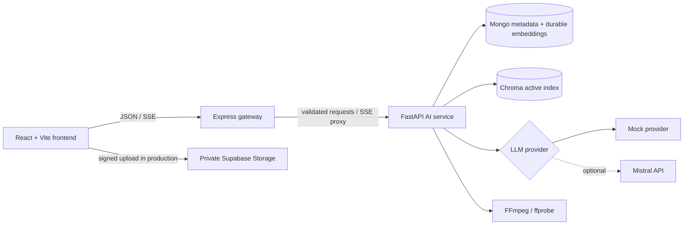
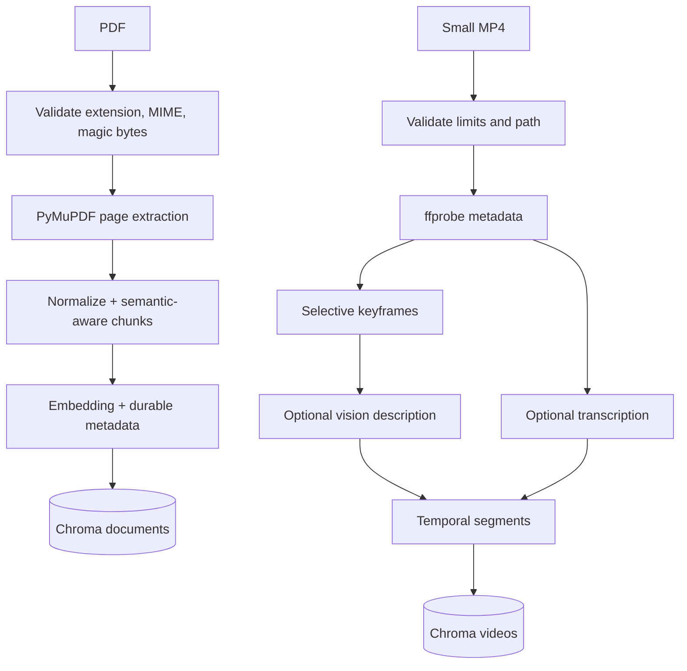
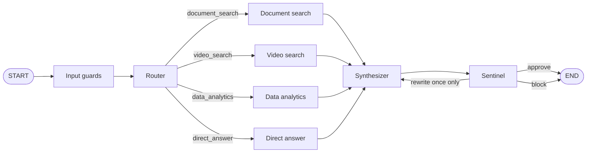
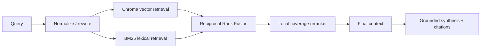
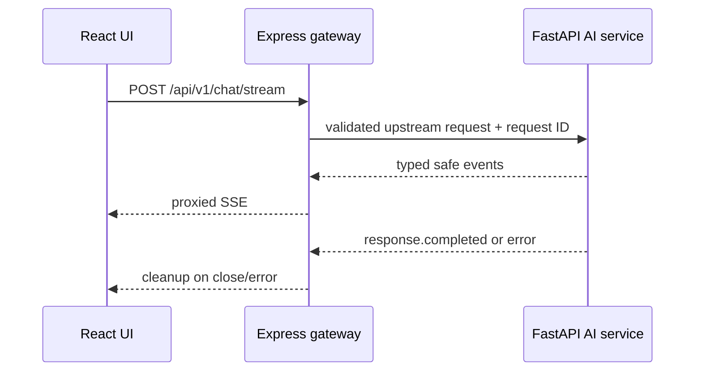

# Synapse

> Enterprise AI Intelligence OS - a portfolio monorepo for grounded PDF, video, and CSV intelligence.

Synapse is an AI-first workspace for asking evidence-backed questions across PDFs, small MP4 videos, and CSV files. Its portfolio value is in typed orchestration, retrieval provenance, deterministic analytics, structured UI, guardrails, evaluation, and a free-tier deployment path - not generic dashboard CRUD.

## Product overview and problem

Useful enterprise information is often divided between policies, recordings, and spreadsheets. Searching each format independently is slow, and a generic chat assistant can answer without supportable evidence. Synapse selects the appropriate capability, retrieves page or timestamp evidence, calculates CSV answers deterministically, and only renders validated interface data.

## Key capabilities

- Typed LangGraph orchestration with a bounded Sentinel rewrite loop.
- PDF validation, PyMuPDF page extraction, semantic-aware chunks, Chroma indexing, and page citations.
- Hybrid document retrieval: Chroma vectors, BM25, Reciprocal Rank Fusion (RRF), and a local CPU reranker.
- Selective MP4 keyframes, optional vision/transcription abstractions, and timestamped video evidence.
- Typed, deterministic CSV operations; no arbitrary generated Python, `eval`, or `exec`.
- Pydantic/Zod Gen-UI validation and a fixed React component registry.
- Layered input, grounding, and output guardrails.
- Safe SSE operational events and reproducible internal evaluation.

## PORTFOLIO DEMO ARCHITECTURE

This architecture is implemented in the repository. It runs locally with `AI_PROVIDER=mock` and is prepared for a free-tier deployment route. It does **not** claim cloud resources are provisioned or that Synapse is a production enterprise deployment.



The gateway deliberately owns only transport: Zod validation, correlation IDs, lightweight rate limiting, CORS, security headers, forwarding, SSE proxying, and normalized errors. Prompts, retrieval, model calls, analytics, and graph logic stay in FastAPI.

### Multimodal ingestion



PDF chunks preserve document ID, filename, page, chunk ID, checksum, timestamp, and text. Video segments preserve video ID, segment ID, filename, start/end seconds, transcript, visual description, combined text, and keyframe reference. That provenance is retained through retrieval and citations.

### LangGraph workflow



Safe traces include the route, tool completion, candidate/citation counts, timings, and guardrail decision. Synapse never emits prompts, private reasoning, or chain-of-thought. The maximum `rewrite_count` is one, which gives the graph an explicit termination bound.

## Hybrid retrieval pipeline



Vector retrieval helps with semantic similarity; BM25 helps with exact terms, phrases, and identifiers. RRF combines rank positions without depending on incompatible raw-score scales. Synapse then uses a CPU-only local reranker based on term coverage, identifier coverage, phrase matches, and fused position. Debug candidates are exposed only when `DEBUG=true`.

## PDF RAG

Before extraction, Synapse rejects invalid, oversized, encrypted, unreadable, and non-PDF masquerading files. PyMuPDF extracts page by page. The chunker prefers heading, paragraph, and sentence boundaries before enforcing configured minimum/maximum/overlap sizes; it does not slice blindly by character count.

The document-search graph node invokes the real hybrid retriever. Search results include exact document ID, filename, page, chunk ID, text, and score. A PDF with too little extractable text returns `ocr_required=true`; automatic paid/expensive OCR is intentionally not invoked.

## Video RAG

Video ingestion targets small MP4 demos. It validates paths and limits, calls `ffprobe` and FFmpeg with argument arrays, timeouts, and checked exit codes, then selects representative keyframes instead of analysing every frame. Vision and transcription are abstractions with mock implementations for tests. Missing vision enrichment is recorded as partial processing instead of crashing ingestion.

Video search returns timestamp provenance. The frontend player seeks to `start_seconds` when the user opens evidence.

## Safe CSV analytics

CSV analytics is constrained by typed Pydantic schemas. Permitted operations include describe, count, sum, mean, min, max, group-by, sort, top-N, and aggregation. Application code validates column existence, allowed operations, aggregation/grouping fields, and row limits before calculating the source-of-truth result deterministically.

An LLM may classify an intent or summarize the result, but it cannot execute code or calculate the authoritative answer. There is no Python shell tool and no use of `eval()` or `exec()`.

## Structured Gen-UI

Gen-UI is data, not executable frontend code. Supported types are `text`, `metric`, `bar_chart`, `line_chart`, `pie_chart`, `table`, `citation_list`, and `video_evidence`. The AI service validates payloads with Pydantic; the frontend validates equivalent Zod schemas and renders only through a fixed registry.

Unknown types, malformed chart data, invalid keys, and script/HTML attempts fail closed to safe text. The system does not accept model-produced React, JSX, JavaScript, HTML, dynamic imports, or `eval`.

## Sentinel guardrails

Sentinel is layered rather than one generic LLM prompt:

- Input guards enforce length limits and detect obvious injection, dangerous tool instructions, and system-prompt extraction attempts.
- Grounding guards verify citation existence, citation-to-context mapping, provenance fields, evidence coverage, context relevance, and unsupported claims.
- Output guards validate Gen-UI, output length, script/HTML rejection, and secret-like output patterns.

Most guards are deterministic. Optional Mistral semantic judgement is narrowly used only when deterministic logic cannot decide. Sentinel can approve, request one rewrite, or block; it never discloses hidden prompts or reasoning.

## Evaluation methodology

The version-controlled dataset and runner make evaluation reproducible:

```powershell
cd ai-service
.\.venv\Scripts\python.exe -m app.evaluation.run
```

It records retrieval Recall@K, MRR, latency, and vector-only versus hybrid comparison; route/tool-selection accuracy; groundedness, citation coverage, and answer-relevance proxies; guardrail detection/block/rewrite metrics; and total/retrieval/generation/guardrail latency, provider calls, and estimated token usage. Summaries use MongoDB when configured and local JSON otherwise. They exclude prompts, hidden reasoning, and full retrieved contexts.

## Observability and SSE



Events include `request.started`, `route.selected`, retrieval start/completion, generation lifecycle/tokens, `genui.created`, `guardrail.completed`, `response.completed`, and `error`. Client/upstream disconnects, timeouts, cleanup, and correlation IDs are handled without exposing private reasoning.

## Free-tier deployment architecture

| Component | Target |
| --- | --- |
| Frontend | Vercel Hobby |
| Gateway | Separate Vercel project |
| AI service | Render Free Web Service |
| Metadata/embeddings | MongoDB Atlas Free |
| Private file objects | Supabase Storage Free |
| Optional provider | Mistral free mode, quota permitting |
| Active index | Chroma rebuilt at startup |

Large PDFs/videos do not pass through Vercel functions. The browser receives a server-generated signed URL, uploads directly to private `synapse-assets`, then submits an object reference to FastAPI. The service-role key stays server-side. Mongo keeps text, provenance, embedding vector/model/version, checksum, and timestamp so Chroma can rebuild without another embedding call. `/health` stays fast; `/ready` reports reconstruction state.

See [deployment instructions](docs/DEPLOYMENT.md) and the [free-tier strategy](docs/FREE_TIER_STRATEGY.md).

## PRODUCTION ENTERPRISE ARCHITECTURE

The following are sensible future evolution items; they are **not implemented or deployed** here: Redis-backed distributed rate limiting/caching, dedicated ingestion workers and task queues, managed vector infrastructure, Kubernetes/autoscaling, centralized persistent observability, enterprise SSO/RBAC/tenant isolation, and managed secret storage. An enterprise implementation would decouple long-running ingestion into workers, add identity and audit controls, run a highly available vector/search layer, and scale gateway/API workloads independently.

## Scaling strategy

The current portfolio architecture is intentionally optimized for low-cost learning and demonstration, not high availability. A production evolution would first move expensive PDF/video work to isolated queued workers, then add shared caching/rate limiting, managed vector/search capacity, identity and tenant controls, durable observability, and independently scalable gateway/API workloads. Kubernetes and autoscaling are possible later operational choices, not current Synapse features.

## Technology stack

| Area | Technology |
| --- | --- |
| Frontend | React 19, TypeScript, Vite, Tailwind, shadcn-compatible structure, Recharts, Zod |
| Gateway | Node.js, TypeScript, Express 5, Zod, CORS, Helmet |
| AI service | Python 3.11+, FastAPI, Pydantic v2, Uvicorn, LangGraph |
| Retrieval | ChromaDB, rank-bm25, local coverage reranker |
| Ingestion | PyMuPDF, FFmpeg, ffprobe |
| Persistence | MongoDB, Supabase Storage, ChromaDB, local/test alternatives |
| Providers | Mock and Mistral abstractions |

## Local setup

Prerequisites: Node `>=20.19`, npm `>=10`, Python `>=3.11`, and FFmpeg/ffprobe on `PATH` for video ingestion. MongoDB, Supabase, and Mistral are optional and not required for mock-mode tests.

```powershell
npm install
cd ai-service
py -3.11 -m venv .venv
.\.venv\Scripts\python.exe -m pip install --upgrade pip
.\.venv\Scripts\python.exe -m pip install -e ".[dev]"
Copy-Item .env.example .env
```

Set `AI_PROVIDER=mock` in `ai-service/.env`. Never place server secrets in frontend `VITE_*` variables. Then use three terminals from the repository root:

```powershell
# AI service
cd ai-service
.\.venv\Scripts\python.exe -m uvicorn app.main:app --host 127.0.0.1 --port 8000 --reload
```

```powershell
# Gateway
npm run dev:gateway
```

```powershell
# Frontend
npm run dev:frontend
```

Open the Vite URL (normally `http://localhost:5173`). If it cannot connect, first check `http://localhost:8000/health`, `http://localhost:8000/ready`, and `http://localhost:4000/health`.

## Environment variables

Checked-in `.env.example` files are the complete canonical list and contain safe placeholders only.

| Scope | Variables | Purpose |
| --- | --- | --- |
| Frontend | `VITE_GATEWAY_URL` | Public production gateway origin. |
| Gateway | `AI_SERVICE_URL`, `FRONTEND_ORIGIN`, `NODE_ENV` | Upstream URL and allowed UI origin. |
| Provider | `AI_PROVIDER`, `MISTRAL_API_KEY`, `MISTRAL_CHAT_MODEL`, `MISTRAL_VISION_MODEL`, `MISTRAL_EMBED_MODEL` | Server-side provider selection/models. |
| Metadata | `MONGODB_URI`, `MONGODB_DATABASE` | Optional durable records. |
| Storage | `SUPABASE_URL`, `SUPABASE_SERVICE_ROLE_KEY`, `SUPABASE_BUCKET` | Private signed uploads/object access. |
| Retrieval/video | `VECTOR_TOP_K`, `BM25_TOP_K`, `RERANK_TOP_K`, `FINAL_CONTEXT_K`, `DEBUG`, video limits | Retrieval behavior and development limits. |

Never commit, log, expose through API/SSE, or bundle credentials in the frontend.

## Testing

```powershell
npm run lint
npm run typecheck
npm run test
npm run build
cd ai-service
.\.venv\Scripts\python.exe -m ruff check --no-cache app tests
.\.venv\Scripts\python.exe -m mypy app
.\.venv\Scripts\python.exe -m pytest -p no:cacheprovider
.\.venv\Scripts\python.exe -m pip check
```

Mock/offline tests cover routing/termination, provider behavior, PDF provenance, hybrid fusion, video abstractions, constrained analytics, Gen-UI rejection, Sentinel adversarial cases, SSE, persistence/rebuild, evaluation, and frontend schemas/helpers. See [TESTING.md](docs/TESTING.md) and the [project verification checklist](docs/PROJECT_VERIFICATION_CHECKLIST.md).

## Known limitations

- Portfolio implementation only: no authentication, SSO, RBAC, tenancy, malware scan, distributed rate limit, centralized alerting, or enterprise audit retention.
- Free services have cold starts, quotas, ephemeral local disk, and bounded Chroma reconstruction capacity.
- OCR is intentionally not automatic; image-only PDFs report `ocr_required`.
- Video handling targets small MP4 demos and requires FFmpeg/ffprobe.
- Mistral can be quota-limited; mock mode enables offline development but does not provide natural-quality model answers.
- CSV operations remain intentionally limited to the approved schema.

See [SECURITY.md](docs/SECURITY.md) for threats, mitigations, and residual risk.

## Demo

1. Start all three services in mock mode.
2. Upload a text PDF and ask a known question; inspect exact page citations.
3. Upload a small MP4; ask about a moment and open timestamp evidence.
4. Select/upload a CSV locally; ask “Compare revenue across regions” and inspect deterministic output.
5. Ask “Explain RAG” and observe route/synthesis/Sentinel events without chain-of-thought.
6. Run the evaluation command and view the recent summary.

For concise, code-grounded interview answers, see [INTERVIEW_GUIDE.md](docs/INTERVIEW_GUIDE.md). For the full documentation map, start with [ARCHITECTURE.md](docs/ARCHITECTURE.md), [AI_DESIGN.md](docs/AI_DESIGN.md), [API_CONTRACTS.md](docs/API_CONTRACTS.md), [SECURITY.md](docs/SECURITY.md), and [BUILD_LOG.md](docs/BUILD_LOG.md).
