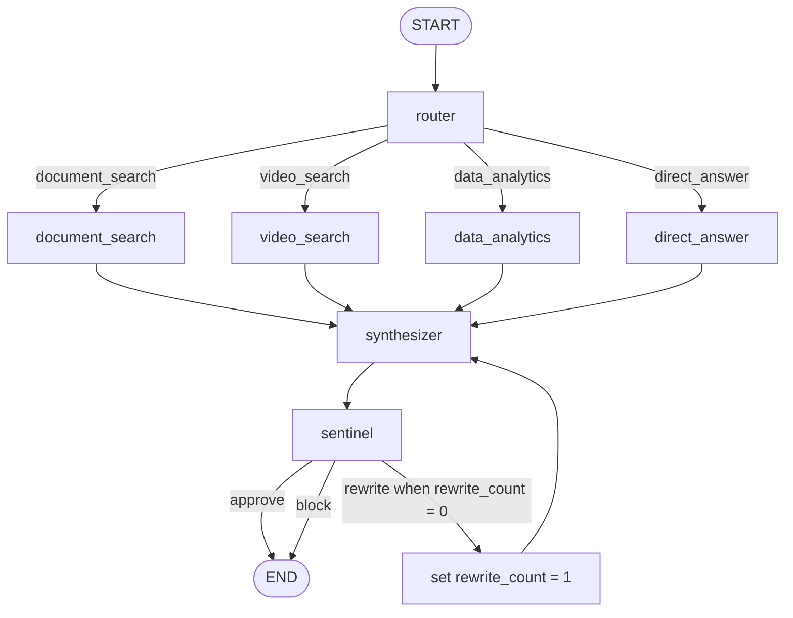

# AI System Design

## Status

This is the target AI design. Phase 7 adds constrained deterministic CSV analytics alongside the
Phase 5 hybrid PDF and Phase 6 video pipelines. Structured provider output selects the route and a
closed analytics plan, but application code calculates and renders every source-of-truth numeric
result. Sentinel remains deterministic and bounded. Gen-UI remains future work.

## Design Goals

- Produce useful answers grounded in PDF pages, video timestamps, or deterministic CSV results.
- Preserve provenance from ingestion through the final response.
- Keep all model output constrained, validated, and observable.
- Prefer deterministic logic for routing shortcuts, calculations, validation, and safety checks.
- Minimize provider calls and support network-free automated tests through mock providers.
- Avoid chain-of-thought collection or disclosure.

## Multimodal RAG

Synapse uses a shared evidence model across modality-specific ingestion and retrieval pipelines. A normalized evidence item includes a stable source ID, modality, display name, content excerpt or description, location metadata, retrieval scores, and version information. Location is page-based for PDFs, time-range-based for video, and operation/result-based for datasets.

### PDF Pipeline

1. Validate MIME type, extension, size, readability, encryption status, and page limits.
2. Extract text page-by-page with PyMuPDF.
3. Clean repeated headers/footers and malformed whitespace without losing page boundaries.
4. Create semantic chunks with controlled overlap.
5. Store each chunk with source ID, canonical filename from trusted metadata, page number, chunk ID, checksum, parser version, and embedding version.
6. Index embeddings in ChromaDB and lexical terms in BM25.
7. Persist sufficient chunk and embedding data in the durable repository for index reconstruction.

Phase 4 implements the dense portion of this pipeline. It validates PDF extension, media type,
bounded size, signature, readability, encryption state, and page count before extraction. Semantic
chunking prefers headings, then paragraphs, then sentences, and finally word boundaries only for an
oversized sentence. Configurable maximum, minimum, and overlap token estimates are enforced without
joining text across page boundaries. Every persisted chunk carries `document_id`, trusted
`filename`, `page_number`, `chunk_id`, global `chunk_index`, `text`, `token_estimate`, SHA-256
`checksum`, and UTC `created_at`.

Repeated short page-edge text and malformed whitespace are normalized before chunking. PDFs below
the configured extractable-text threshold are recorded with `ocr_required=true` and zero chunks;
Phase 4 deliberately does not invoke OCR.

### Video Pipeline

1. Validate the `.mp4` extension, media type, bounded byte size, MP4 signature, and a server-generated
   storage path.
2. Inspect container/stream metadata with `ffprobe`, reject non-video containers and over-duration
   inputs, and record duration, dimensions, and audio presence.
3. Select timestamps at `KEYFRAME_INTERVAL_SECONDS`, capped by `MAX_KEYFRAMES`, then ask FFmpeg for
   exactly one JPEG at each selected timestamp. No every-frame scan is performed.
4. Optionally call `LLMProvider.describe_image()` once per selected keyframe. After the first vision
   failure, stop further vision calls, mark enrichment unavailable, and continue ingestion.
5. Optionally extract bounded mono 16 kHz PCM audio and pass it to `TranscriptionProvider`. The
   disabled and Mock implementations keep local development and tests free of paid dependencies.
6. Align timestamped transcript spans and visual descriptions into temporal segments, embed their
   combined text, persist authoritative metadata/embeddings, and index a separate Chroma collection.
7. Resolve semantic matches back through authoritative segment records and return `video_id`,
   filename, `segment_id`, start/end seconds, description, and bounded score.

Each temporal segment stores `video_id`, trusted `filename`, `segment_id`, `start_seconds`,
`end_seconds`, transcript, visual description, combined text, a storage-root-relative keyframe path,
and safe embedding metadata. `MAX_VIDEO_SIZE_MB`, `MAX_VIDEO_DURATION_SECONDS`, `MAX_KEYFRAMES`, and
`KEYFRAME_INTERVAL_SECONDS` cap cost and latency. The current Phase 6 selector is interval-based,
not content-aware scene detection; it is intentionally predictable for small portfolio videos.

FFmpeg/ffprobe subprocesses never interpolate user input into a shell. Calls use explicit argument
lists, `shell=False`, validated in-root paths, configured timeouts, checked return codes, and output
existence checks. User filenames are display metadata only; generated IDs define artifact paths.

### Hybrid Retrieval

Phase 5 searches document chunks through both dense vector retrieval and BM25 lexical retrieval.
Before either retrieval stage, Unicode and whitespace are normalized and common request scaffolding
such as “find … in my documents” is removed deterministically. The rewrite does not call an LLM and
does not invent query facts.

**Vector search** embeds the normalized query with the configured `LLMProvider` and queries the
Chroma cosine index. It is strongest when query and evidence share meaning but not necessarily exact
wording. Chroma match identifiers are resolved through the authoritative metadata repository before
they can become candidates.

**BM25 lexical search** uses Apache-licensed `rank-bm25` over the authoritative stored chunk text.
Synapse applies the same lowercase, Unicode-aware tokenization and stop-word filtering to query and
corpus. The small local index is rebuilt in memory per request in Phase 5, which avoids a second
durable index while the corpus is still portfolio-scale. BM25 is particularly useful for exact
identifiers, product codes, names, and uncommon policy terms that dense retrieval can underweight.

The two ranked lists are combined using **Reciprocal Rank Fusion (RRF)**:

```text
RRF_score(item) = sum(1 / (k + rank_in_list))
```

A candidate receives one reciprocal-rank contribution from each list in which it appears. Phase 5
uses `k=60`; it fuses ranks rather than trying to compare incomparable cosine and BM25 score scales.
Candidates found by both retrievers are naturally rewarded.

The **lightweight reranker** is a deterministic CPU-only coverage scorer over the fused pool. It
combines normalized RRF position, query-term coverage, exact identifier coverage, and exact phrase
presence. This avoids paid APIs, runtime model downloads, and network-dependent tests. The bounded
**context selector** then removes duplicate chunk IDs, requires complete document/page provenance,
and selects at most `FINAL_CONTEXT_K` chunks for synthesis.

Hybrid retrieval can outperform vector-only retrieval because semantic similarity and lexical
matching fail in different ways: vectors can recover paraphrases, while BM25 preserves rare exact
terms. RRF provides a stable union without score calibration, and reranking rechecks the query
against the smaller fused pool. Hybrid retrieval is not guaranteed to win every dataset, so Synapse
reports vector-only and hybrid metrics separately instead of assuming improvement.

The normal search/chat APIs expose only selected evidence and one bounded final relevance score in
the backward-compatible `similarity_score` field. Stage candidates and raw stage scores are internal.
When and only when `DEBUG=true`, the application registers
`POST /api/v1/debug/retrieval/documents`, which exposes `vector_candidates`, `bm25_candidates`,
`fused_candidates`, `reranked_candidates`, and `final_context`. With `DEBUG=false`, the route is not
registered and is absent from OpenAPI.

## LangGraph State

The graph state will be a typed structure with reducers only where concurrent updates are intentional. A conceptual state is:

```text
request_id / correlation_id
query
conversation_summary
authorized_source_ids
available_modalities
route
route_confidence
tool_requests
tool_results
evidence[]
analytics_results[]
draft_answer
gen_ui_components[]
citations[]
sentinel_findings[]
sentinel_decision
rewrite_count (0 or 1)
safe_trace_events[]
metrics
public_error
```

Raw chain-of-thought is neither a state field nor an event. Tool results and evidence use typed domain models rather than free-form agent messages wherever possible.

### Phase 2 Executable Graph



Phase 2 compiles this topology with LangGraph `StateGraph`. The graph receives a fully initialized
`SynapseState`; nodes return typed partial updates. The longest valid path is one route, first
synthesis, Sentinel rewrite, second synthesis, and final Sentinel approval or block. The
orchestration service also supplies a recursion limit of 12 as a secondary fail-safe.

The implemented state contains `request_id`, `thread_id`, `user_query`, `intent`, `route`,
`retrieved_context`, `tool_results`, `draft_response`, `final_response`, `citations`, `genui`,
`guardrail_result`, `errors`, `inference_metadata`, `trace`, and `rewrite_count`. Only a safe subset
is serialized by the public API; user input, drafts, retrieved context, tool internals, prompts, and
credentials are excluded.

## Router

The Router selects one of `document_search`, `video_search`, `data_analytics`, or `direct_answer`, with an option for a deliberately bounded multi-tool plan if a later phase explicitly authorizes it. It receives source availability, the user query, and safe conversation context.

Routing combines deterministic signals with structured model classification. Examples include explicit dataset operations, selected source types, and references to pages or timestamps. Its output is schema-validated and includes a route, confidence, brief safe rationale category, and typed tool parameters—not hidden reasoning.

In Phase 3, Router calls `LLMProvider.generate_structured()` with a Pydantic
`RouterClassification`. Mistral uses native structured parsing; Mock returns the same schema through
deterministic, word-boundary classification so tests remain offline and reproducible.

## Document Search Tool

The Phase 5 tool accepts a query, optional document IDs, and a bounded final-context limit. It runs
the hybrid stages described above and returns selected text with trusted document IDs, filenames,
page numbers, chunk IDs, and final relevance scores. Orphaned index matches and provenance-incomplete
context are discarded. The Synthesizer receives only final context and deterministic citations; it
cannot author or rewrite provenance. Empty retrieval is an explicit result that the Synthesizer must
respect.

## Video Search Tool

The Phase 6 tool embeds a normalized query, searches the video-segment Chroma collection, resolves
every match through the authoritative metadata repository, and returns bounded temporal evidence
with trusted video names, segment IDs, start/end timestamps, descriptions, and scores. LangGraph
constructs citations only from those resolved records. It never converts a model guess into a
precise timestamp or accepts model-authored provenance.

## Data Analytics Tool

The Phase 7 analytics tool executes only a typed allowlist of operations over a validated CSV-backed
dataset:

- `describe`
- `count`
- `sum`
- `mean`
- `min`
- `max`
- `group_by`
- `sort`
- `top_n`
- `aggregation`

CSV ingestion validates extension, media type, UTF-8 encoding, unique/non-empty headers, consistent
row width, byte size, row count, and column count. It infers only `string`, `number`, and `boolean`
column types and persists raw cells plus trusted schema/checksum metadata through a repository
interface.

An analytical plan is a Pydantic-discriminated union. Scalar `sum`, `mean`, `min`, and `max`
operations require a numeric column. `group_by` requires one to three existing grouping fields and a
valid aggregation field for non-count operations. `sort` accepts at most three validated fields and
enumerated directions. `top_n`, grouped output, and multi-`aggregation` output are capped by the
configured result limit. Unknown operation names, extra fields, missing columns, non-numeric
aggregation fields, invalid aliases, and excessive limits fail closed.

The LLM participates only through `generate_structured(AnalyticsPlan)`. The prompt supplies opaque
dataset IDs, trusted column/type metadata, and the configured output cap; it explicitly forbids
code, SQL, expressions, and calculations. Mock mode produces the same schema deterministically.
The returned plan is validated again against the authoritative repository before dispatch.

The executor dispatches through explicit `isinstance` branches to fixed application methods and
uses `Decimal` for numeric source calculations. It has no Python shell, SQL executor, dynamic
imports, `eval`, `exec`, or general expression field. Results contain `summary`, `columns`,
`result_rows`, `statistics`, and `recommended_visualization`. In the graph, that deterministic
summary is used directly as the draft; provider text generation cannot recalculate or alter it.

The local-development API also accepts an already typed operation directly. All reported numbers
come from the same deterministic executor regardless of whether the caller is HTTP or LangGraph.

## Synthesizer

The Synthesizer transforms tool results into a concise grounded answer and structured UI proposal. It receives only selected evidence and deterministic analytics results. Its structured output separates:

- natural-language answer;
- atomic citation references;
- allowed Gen-UI components;
- uncertainty or insufficient-evidence status;
- safe display metadata.

Instructions require it to abstain or qualify claims when evidence is insufficient. A Sentinel-requested rewrite includes specific structured findings and occurs at most once.

## Sentinel

Sentinel is a layered pipeline, not a single unconstrained LLM call.

### Input Checks

- query length and request-size limits;
- prompt-injection heuristics;
- suspicious instructions to reveal prompts, override policy, or invoke tools;
- source authorization and tool-parameter validation;
- dangerous or unsupported content patterns defined by product policy.

Retrieved content is treated as quoted evidence, not as executable instruction. Deterministic findings can reject or sanitize a request before orchestration.

### Grounding Checks

- every cited ID exists in the selected evidence set;
- document citations map to the trusted filename and page stored in provenance;
- video citations map to stored temporal segments;
- numerical claims map to deterministic analytics results;
- material factual claims have evidence coverage;
- cited context is relevant to the associated claim;
- unsupported claims are flagged.

Existence, mapping, schema, and numerical checks are deterministic. A structured semantic judge may assess relevance or entailment only when rules cannot decide, and must be isolated behind `LLMProvider` for mockable tests.

### Output Checks

- Pydantic Gen-UI validation;
- component count, text length, row count, and total output limits;
- allowlist enforcement for component and field types;
- rejection of HTML, scripts, event handlers, URLs with unsafe schemes, and executable content;
- accidental secret-pattern scanning and redaction/blocking;
- citation and evidence consistency after serialization.

### Decisions and Bounded Rewrite

Sentinel returns `approve`, `rewrite`, or `block` with machine-readable finding codes. `rewrite` is valid only when `rewrite_count == 0`; the graph increments the value before returning to Synthesizer. After one rewrite, Sentinel must approve, block, or issue a conservative insufficient-evidence response. It cannot loop again.

## Structured Generative UI

The model never produces React, JSX, JavaScript, or HTML. It proposes data matching a versioned discriminated union. Initial allowed component types are:

- `text`
- `metric`
- `bar_chart`
- `line_chart`
- `pie_chart`
- `table`
- `citation_list`
- `video_evidence`

Python validates the union with Pydantic v2 before an API response is emitted. Shared JSON examples/schema guide a matching Zod discriminated union in TypeScript. The frontend maps each valid type to a hard-coded, tested component registry. Unknown versions or types fail closed to a safe text representation or normalized error.

Chart and table data should reference deterministic analytics outputs where numbers are involved. Labels, series counts, row counts, URLs, and text sizes are bounded. Content is rendered as text by default and never injected as raw HTML.

## Citation Grounding

Each evidence item receives a server-generated stable ID. The Synthesizer cites those IDs, and the server resolves display fields from trusted provenance rather than accepting filenames, pages, or timestamps authored by the model.

A final claim-to-evidence map associates answer spans or claim IDs with evidence IDs. Grounding validation ensures referenced evidence exists, belongs to the current authorized request, and supports the same modality/location presented to the user. If retrieval returns no suitable evidence, the response must state that limitation instead of fabricating a citation.

## Evaluation

Evaluation runs against versioned fixtures and records configuration, dataset version, provider mode, and latency. Mock mode provides deterministic CI coverage; curated Mistral runs may be executed separately when quota is available.

Phase 5 adds `sample-data/evaluations/document-retrieval.v1.json`. Each case labels the query,
relevant filename, page, and global chunk index. The offline evaluator runs the same cases through
`vector_only` and `hybrid` modes and reports Recall@K and Mean Reciprocal Rank. Run it from
`ai-service/` with `python -m app.evaluation.cli`.

### Retrieval

- Recall@K against labeled relevant evidence
- Mean Reciprocal Rank (MRR)
- retrieval latency by dense, lexical, fusion, rerank, and total stages

### Routing

- route accuracy
- tool-selection accuracy
- invalid or unnecessary tool-call rate

### Generation

- groundedness proxy from claim/evidence mapping
- citation coverage
- answer relevance proxy
- abstention correctness on insufficient evidence

### Guardrails

- prompt-injection detection precision/recall on a labeled suite
- unsupported-claim detection rate
- false-positive rate
- rewrite and block rates
- schema and unsafe-output rejection rate

### System

- total, retrieval, generation, and guardrail latency
- provider call count
- estimated input/output token usage
- ingestion throughput and failures
- error rate by public error code

Evaluation results must distinguish deterministic metrics from model-judge scores. Judge provider/model/version and rubric version must be recorded. Model-judge output is a signal, not proof of correctness.

## AI Observability and Streaming

SSE events will communicate lifecycle updates such as run accepted, route selected, tool started/completed, evidence available, answer delta, Sentinel decision, metrics summary, completion, and normalized error. Events contain safe operational data only. They must not reveal system prompts, hidden reasoning, secrets, or raw provider traces.

Metrics link stages through correlation and run IDs. Provider calls record model identifier, duration, success/failure, retry count, and estimated token usage while respecting data-redaction rules.

## Provider Abstractions and Mock Mode

`LLMProvider` exposes `generate()`, `generate_structured()`, `describe_image()`, and `embed()`.
Phase 7 uses structured generation in Router and Analytics Planner, text generation for non-analytics
Synthesizer routes, embeddings during
document/video indexing and querying, and optional vision descriptions for selected video
keyframes. BM25, RRF, document reranking, temporal alignment, and context selection remain local
deterministic operations. Analytics arithmetic and graph output are also deterministic; provider
types and model-authored values never enter the executor as executable code.

`MistralProvider` reads its credential only from typed environment configuration and never returns or
logs it. Requests have a bounded timeout. The adapter disables SDK-level retries and applies its own
small bounded policy: network failures, timeouts, and HTTP 5xx responses may retry; HTTP 429 and
other client failures do not. Successful results expose only provider, model, operation, latency,
retry count, and token counts when supplied by the provider.

`MockProvider` returns deterministic, schema-validated, fixture-driven responses without network
access and is the mandatory automated-test provider.

The runtime setting is planned as:

```text
AI_PROVIDER=mistral|mock
MISTRAL_API_KEY=
MISTRAL_CHAT_MODEL=
MISTRAL_VISION_MODEL=
MISTRAL_EMBED_MODEL=
AI_REQUEST_TIMEOUT_SECONDS=30
AI_MAX_TRANSIENT_RETRIES=2
```

Provider-specific SDK types do not enter graph state or public contracts. The safe provider endpoint
returns only the active provider, model identifiers, and whether it is Mock mode.
