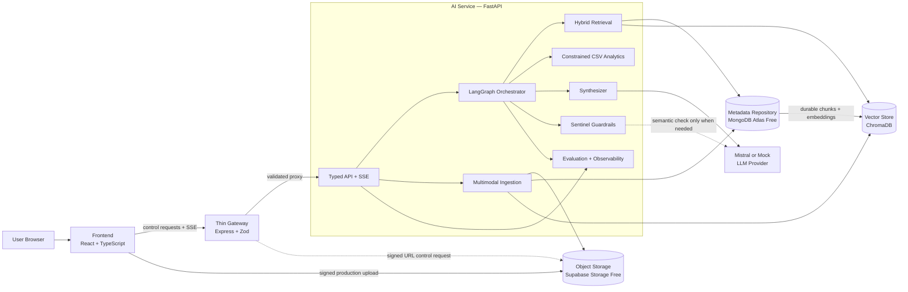
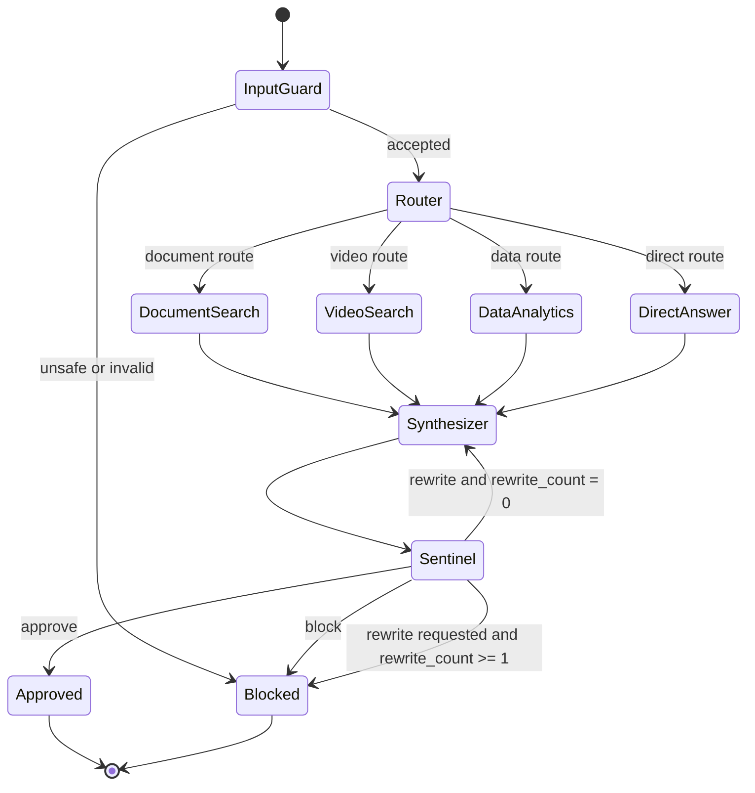
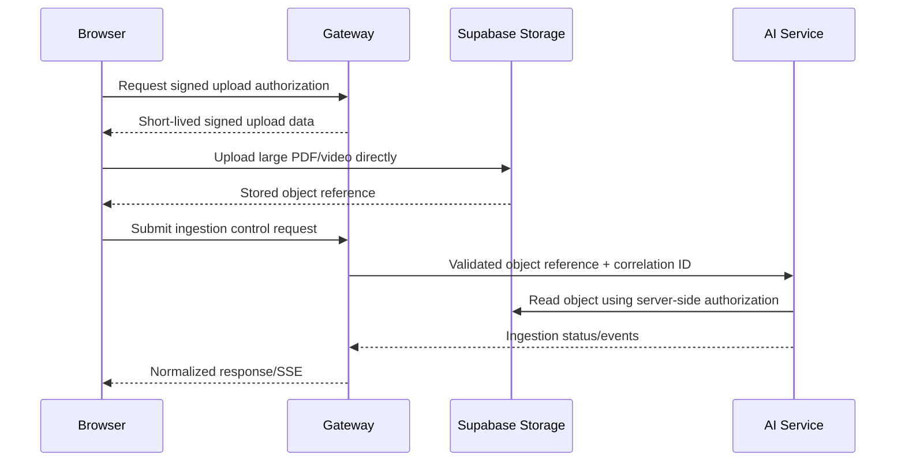

# Synapse Architecture

## Status and Scope

This document defines the target architecture. Phase 1 implements only the local monorepo foundation:
a React development shell, a thin Express gateway with `GET /health`, and a FastAPI AI-service
boundary with `GET /health`. The AI, retrieval, persistence, ingestion, streaming, and cloud resources
shown below remain design contracts and are not implemented or deployed.

## Architectural Principles

1. The AI service owns all reasoning, retrieval, analytics, grounding, guardrails, evaluation, and AI-provider behavior.
2. The gateway is a transport and security boundary, not an AI or business-logic service.
3. The frontend renders typed state and fixed Gen-UI components; it contains no AI logic.
4. Evidence provenance survives ingestion, retrieval, synthesis, and response serialization.
5. External infrastructure is accessed through replaceable provider or repository interfaces.
6. Deterministic checks and calculations take precedence over LLM judgment.
7. Agent transitions are bounded and observable without exposing chain-of-thought.
8. The portfolio topology must support a zero-cost deployment and an offline mock mode.

## Logical System Architecture

## Service Responsibilities

### Frontend

The Phase 1 frontend is a professional React, TypeScript, Vite, and Tailwind development shell using
shadcn-compatible aliases, CSS variables, utilities, and component placement. The planned frontend
will later provide the AI chat workspace, knowledge library, ingestion controls, streamed response
rendering, citation and video-evidence views, agent activity, evaluation metrics, and health/readiness
indicators. It will validate Gen-UI payloads with Zod and render only known component types through a
fixed registry.

It must not own prompts, routing rules, embeddings, retrieval, provider calls, grounding decisions, or analytics calculations.

### Gateway

The Phase 1 gateway implements typed environment validation, Helmet security headers, CORS, request
logging, and process liveness at `GET /health`. Later gateway phases may add request validation,
correlation IDs, lightweight rate limiting, request/SSE proxying, and normalized transport errors. It
should remain independently deployable as a Vercel project.

It must not import or reproduce LangGraph, prompts, embeddings, vector search, retrieval, Mistral behavior, AI agents, or business-intelligence rules.

### AI Service

The Phase 1 AI service implements a FastAPI application factory, Pydantic v2 response model, typed
Pydantic settings, OpenAPI, and process liveness at `GET /health`. It will become the engineering core
in later approved phases and own multimodal ingestion, hybrid retrieval, constrained analytics,
LangGraph orchestration, provider selection, structured Gen-UI construction, citation grounding,
Sentinel guardrails, evaluations, safe traces, and streaming event production.

## Bounded LangGraph Flow

`rewrite_count` begins at zero and may be incremented once. A second rewrite request terminates safely as blocked or returns a conservative fallback; it never creates another loop.

## Ingestion and Retrieval Flow

Video processing samples scenes and representative frames rather than analyzing every frame. This controls provider usage and ingestion latency while preserving timestamped evidence.

## Upload Trust Boundaries

Local development may expose direct FastAPI upload endpoints. Production large binaries must not traverse the Vercel gateway.

## Storage and Reconstruction

- `MetadataRepository` stores document/video/dataset metadata, ingestion state, provenance, durable chunk content, embedding vectors (or a lossless representation), embedding model/version, and index reconstruction metadata.
- `ObjectStorageProvider` stores original and derived objects such as PDFs, videos, sampled frames, and approved transcript artifacts.
- `VectorStore` provides semantic indexing and retrieval. In the portfolio topology it uses ChromaDB on ephemeral Render storage.
- `LLMProvider` isolates Mistral and mock behavior. Embedding behavior should likewise be replaceable and versioned.

On AI-service startup, a reconstruction process compares durable index metadata with local Chroma state and rebuilds missing collections from stored embeddings. It must not call the embedding API for already embedded, version-compatible chunks.

## Security and Safety Boundaries

- Validate external payloads at both gateway and AI-service boundaries.
- Treat document, transcript, frame-description, and CSV content as untrusted data, never as instructions.
- Use signed, short-lived upload access and validate object ownership before ingestion.
- Keep secrets in environment variables and redact secret-like output patterns.
- Allow only enumerated analytics operations and Gen-UI component types.
- Apply query, file, context, output, and provider-call limits.
- Return public error codes and correlation IDs; keep sensitive internals out of client errors.

## Observability

Safe traces may include correlation ID, run ID, selected route, tools started/completed, evidence IDs, retrieval counts, validation outcomes, rewrite count, provider call count, estimated token usage, and stage timings. Prompts containing sensitive content, raw secrets, hidden reasoning, and chain-of-thought must not be exposed.

## Deployment Topology

The planned portfolio topology is frontend on Vercel Hobby, gateway in a separate Vercel project, AI service on Render Free Web Service, MongoDB Atlas Free for durable metadata, Supabase Storage Free for objects, ChromaDB inside the AI service, and Mistral free mode with mock fallback. It is a demonstration topology with cold starts, quotas, ephemeral compute storage, and limited scale—not a deployed enterprise platform. See `FREE_TIER_STRATEGY.md`.
