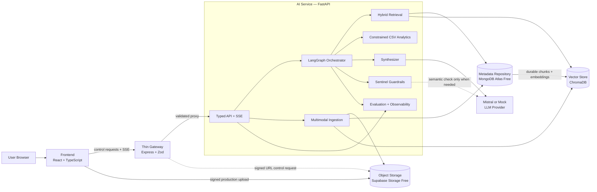
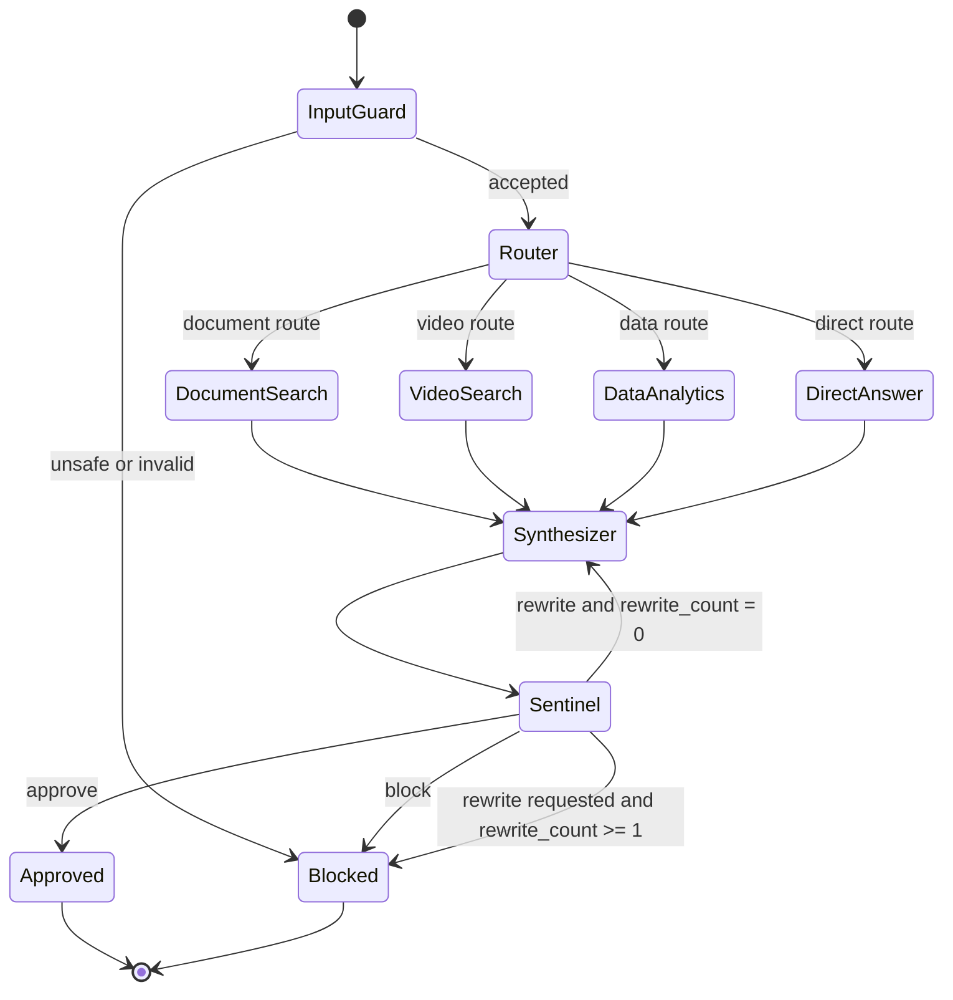
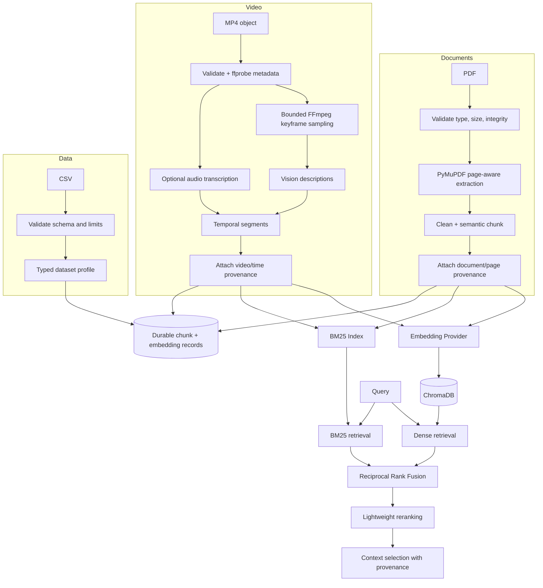
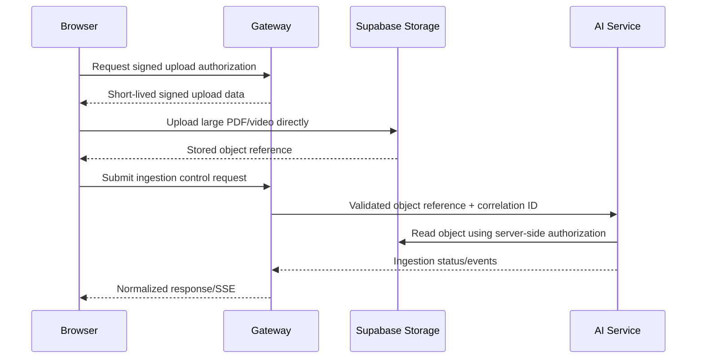

# Synapse Architecture

## Status and Scope

This document defines the target architecture. Through Phase 15, the repository implements the
monorepo foundation, strongly typed LangGraph orchestration, replaceable Mock/Mistral inference, and
citation-grounded retrieval over PDFs and small MP4 videos plus constrained deterministic analytics
over bounded CSV files. It implements a secure data-only Gen-UI protocol and layered Sentinel input,
grounding, and output guardrails plus typed SSE through React, Express, and FastAPI. A polished,
responsive AI-first frontend consumes those contracts without moving AI logic into the browser.
MongoDB Atlas, private Supabase Storage, and reconstructable Chroma now have implemented provider
boundaries, with network-free local and test alternatives. Internal evaluation now benchmarks
retrieval, routing, generation, guardrails, and system telemetry without a hosted observability
dependency or collection of private reasoning. The same boundaries are now packaged for a zero-cost
portfolio topology: separate Vercel projects for the Vite frontend and thin Express gateway, a
Dockerized Render FastAPI service, Atlas as the durable metadata/vector authority, private Supabase
object storage, and reconstructable Chroma on ephemeral compute. No cloud resource is provisioned
automatically.

## Architectural Principles

1. The AI service owns all reasoning, retrieval, analytics, grounding, guardrails, evaluation, and AI-provider behavior.
2. The gateway is a transport and security boundary, not an AI or business-logic service.
3. The frontend renders typed state and fixed Gen-UI components; it contains no AI logic.
4. Evidence provenance survives ingestion, retrieval, synthesis, and response serialization.
5. External infrastructure is accessed through replaceable provider or repository interfaces.
6. Deterministic checks and calculations take precedence over LLM judgment.
7. Agent transitions are bounded and observable without exposing chain-of-thought.
8. The portfolio topology must support a zero-cost deployment and an offline mock mode.

## Logical System Architecture

## Service Responsibilities

### Frontend

The frontend is a professional React, TypeScript, Vite, Tailwind, shadcn-compatible, and Recharts
application. Phase 11 implements the AI chat workspace as its primary surface, plus a knowledge
library with local PDF/video/CSV ingestion controls, streamed answer rendering, a citation/source
drawer, timestamped video evidence, safe agent activity, live Sentinel quality summaries, and
gateway/AI/provider readiness indicators. Phase 8 validates every Gen-UI payload with the shared Zod discriminated union before
selecting one of eight statically imported renderers from a frozen registry. Invalid payloads render
only caller-supplied safe text. No arbitrary import string, `eval`, or raw HTML rendering exists.

Phase 10 adds a small development transport panel and strict incremental SSE parser. It uses
`fetch()` because the stream accepts a validated POST body. Every event is validated with the shared
Zod union, and envelope `id`/`event` values must match JSON sequence/type before rendering.

Phase 11 maps those events to explicit user-facing stages: Thinking, Routing, Searching Documents,
Searching Video, Analyzing Data, Synthesizing, Validating, and Complete. Agent Activity contains
only route, tool, candidate-count, latency, citation-count, and guardrail metadata. The answer stays
visually primary; evidence, execution, validated visual output, and quality follow in that order.
The fixed Gen-UI registry uses statically imported Recharts primitives for bar, line, and pie charts.
Video evidence delegates to a controlled player that assigns `currentTime` from trusted
`start_seconds`. Mobile uses a source drawer and bottom navigation, tablet collapses secondary
detail below the answer, and desktop provides a persistent three-zone workspace.

Local Vite development proxies `/ai-local` to FastAPI for health, library listing, and bounded direct
upload. In production the frontend requests a signed upload URL through the gateway, uploads PDF or
MP4 bytes directly to private Supabase Storage, then submits only the stored object path for
ingestion. CSV direct upload remains local-only.

It must not own prompts, routing rules, embeddings, retrieval, provider calls, grounding decisions, or analytics calculations.

### Gateway

The gateway implements typed environment validation, Helmet security headers, CORS, request
logging, Zod validation, generated request/correlation IDs, fixed-window rate limiting, bounded
upstream requests, disconnect-aware SSE proxying, and normalized JSON/SSE errors. It proxies the
small presign and stored-object JSON controls, but has no PDF/video binary upload route.

It must not import or reproduce LangGraph, prompts, embeddings, vector search, retrieval, Mistral behavior, AI agents, or business-intelligence rules.

### AI Service

The AI service implements a FastAPI application factory, Pydantic v2 API models, typed
settings, OpenAPI, process liveness, LangGraph orchestration, local PDF/video RAG, and safe CSV
analytics.
PDF ingestion validates the file, extracts normalized page-aware text with PyMuPDF, creates semantic
chunks, embeds them through `LLMProvider`, persists trusted metadata, and indexes vectors in
ChromaDB. Document Search normalizes the query, combines Chroma vector results with `rank-bm25`
lexical results through Reciprocal Rank Fusion, reranks locally on CPU, and selects bounded trusted
context. Video ingestion validates MP4 signatures and bounded probe metadata, extracts only a
configured maximum of representative frames, optionally enriches them through vision and offline
mock transcription providers, constructs timestamped segments, and indexes their embeddings in a
separate Chroma collection. Document and video graph routes return real evidence with deterministic
page or timestamp citations. CSV ingestion infers a bounded typed schema and stores trusted raw
cells. The analytics planner can return only a Pydantic-discriminated operation; the executor then
validates column/type/aggregation/limit constraints and calculates with fixed methods and Decimal
arithmetic. Its numeric summary bypasses free-form synthesis, so the LLM is never the numerical
authority. Sentinel remains deterministic with a one-rewrite maximum.

Phase 13 adds a versioned evaluation subsystem beside—not inside—the production graph. A
deterministic Mock-provider run ingests synthetic PDF/CSV fixtures into isolated in-memory
repositories, compares vector-only and hybrid retrieval, invokes the real graph for route/tool and
generation measurements, and exercises the same layered input and grounding guards. Only aggregate
metrics, safe provider/model identifiers, timings, configuration fingerprint, run ID, and timestamp
are persisted. MongoDB stores summaries when selected; otherwise an atomic local JSON snapshot is
used. The recent-summary API and frontend quality observatory never serialize test prompts, model
answers, retrieved context, system prompts, or graph reasoning.
For analytics results with a material visualization recommendation, Synthesizer requests a
Pydantic-structured Gen-UI proposal. The server rejects unsupported types, unknown fields, unsafe
markup, invalid keys, and unbounded data, then verifies that every proposed analytics value exactly
matches deterministic executor output. A pre-router input guard blocks injection, prompt-extraction,
dangerous-tool, and oversized-query patterns before any provider call. Post-synthesis grounding and
output stages validate citation provenance, evidence support and relevance, result integrity,
response bounds, Gen-UI, scripts/HTML, and secret-like patterns. Malformed UI falls back to safe text;
critical provenance or output violations block. Only ambiguous paraphrases can reach a narrow
structured semantic judge. A repairable failure gets one rewrite and never another loop.
Phase 10 projects bounded LangGraph state snapshots into typed lifecycle events and releases answer
chunks only after final Sentinel validation. Client disconnects request iterator cleanup; heartbeat
comments and a total timeout prevent an indefinitely silent stream.

## Bounded LangGraph Flow

`rewrite_count` begins at zero and may be incremented once. A second rewrite request terminates safely as blocked or returns a conservative fallback; it never creates another loop.

## Ingestion and Retrieval Flow

Phase 6 video processing samples representative frames at a configured interval and stops at
`MAX_KEYFRAMES`; it never analyzes every frame. FFmpeg and ffprobe run as argument lists with
`shell=False`, validated storage-root paths, timeouts, and checked return codes. Vision stops after
the first provider failure and preserves a partial record. This controls provider usage and
ingestion latency while preserving timestamped evidence.

## Upload Trust Boundaries

Local development may expose direct FastAPI upload endpoints. Production large binaries must not traverse the Vercel gateway.

## Storage and Reconstruction

- `MetadataRepository` stores document/video/dataset metadata, ingestion state, provenance, durable chunk content, embedding vectors (or a lossless representation), embedding model/version, and index reconstruction metadata.
- `ObjectStorageProvider` stores original and derived objects such as PDFs, videos, sampled frames, and approved transcript artifacts.
- `VectorStore` provides semantic indexing and retrieval. In the portfolio topology it uses ChromaDB on ephemeral Render storage.
- `LLMProvider` isolates Mistral and Mock text, structured, vision, and embedding operations. Phase 4
  connects embeddings to PDF ingestion and document-query retrieval in addition to routing and
  synthesis; provider-specific SDK types remain inside the adapter.

Phase 12 adds the shared `MetadataRepository`, `ObjectStorageProvider`, and `VectorStore` contracts.
`MongoMetadataRepository` stores discriminated metadata records plus chunk/segment text, provenance,
embedding vectors, embedding provider/model, checksum, and timestamp. `SupabaseObjectStorage` uses a
server-only service-role credential for private `synapse-assets` signing and bounded downloads;
only the signed URL, object path, and expiration reach the browser. `ChromaVectorStore` owns separate
document/video namespaces as an active index, never as the durable authority. Local JSON/filesystem
and in-memory/fake adapters keep development and tests cloud-free.

Phase 4 provides `JsonDocumentRepository` and `ChromaDocumentVectorStore` adapters for local
development, plus in-memory/ephemeral equivalents for tests. The JSON repository is authoritative
for filenames, page numbers, chunk IDs, text, checksums, and embeddings. Chroma match IDs are always
resolved through that repository before evidence can reach synthesis. Startup rebuilds an empty
Chroma collection from stored embeddings without repeating provider calls.

Phase 5 builds its small BM25 corpus from authoritative repository chunks per request; BM25 is not a
second source of provenance. RRF and local reranking retain the same trusted `DocumentChunk` object
through every stage. The normal API never serializes intermediate candidates. A diagnostic router is
added to the FastAPI application only when `DEBUG=true`; with the default false value, its retrieval
debug path is absent from both routing and OpenAPI.

Phase 6 provides `JsonVideoRepository` and `ChromaVideoVectorStore` for local persistence, with
in-memory/ephemeral equivalents in tests. The repository is authoritative for video names, segment
IDs, timestamps, transcript/visual text, keyframe references, and embedding metadata. Chroma match
IDs are resolved through that repository before timestamp evidence reaches synthesis. A typed
`TranscriptionProvider` currently supplies disabled and deterministic Mock implementations; no paid
transcription service is required.

Phase 7 provides `JsonDatasetRepository` and an in-memory test adapter for authoritative CSV
metadata and rows. Direct local upload is bounded by byte, row, and column limits and disabled in
production. The closed analytics executor dispatches only by validated model type; it has no Python
shell, SQL engine, expression language, dynamic import, `eval`, or `exec` path. Result rows are
bounded independently of the uploaded row count.

Phase 8 defines the same version `1.0` component union in Pydantic and Zod. Supported types are
`text`, `metric`, `bar_chart`, `line_chart`, `pie_chart`, `table`, `citation_list`, and
`video_evidence`. Component choice is a validated discriminator, never a module path. The frontend
registry contains explicit imports for all eight renderers and has no extension mechanism driven by
model text.

Phase 9 places a deterministic input node before Router and divides final Sentinel processing into
independent grounding and output services. `GuardrailResult` publishes only bounded scores, booleans,
machine-readable reason codes, and a decision. It never serializes prompts, raw evidence, provider
payloads, or hidden reasoning. Semantic grounding is an isolated structured boolean classification
used only when deterministic lexical and provenance checks are inconclusive.

Phase 10 defines typed SSE events for request start, route selection, retrieval, generation, Gen-UI,
guardrails, completion, and normalized errors. FastAPI owns semantic event creation. The gateway
forwards bytes and may add only normalized transport errors when upstream disconnects or times out.
Request and correlation IDs are propagated in response headers and every event.

On AI-service startup, a background reconstruction task compares exact durable chunk/segment ID sets
with both Chroma namespaces. An absent, stale, or incomplete namespace is cleared and rebuilt from
the stored vectors without calling the embedding provider. `GET /health` stays a dependency-free
liveness check; `GET /ready` returns HTTP 503 while reconciliation is running or failed and HTTP 200
only when both retrieval namespaces are usable.

Phase 15 makes the browser's production API origin exclusively `VITE_GATEWAY_URL`. The gateway
exposes a fixed small-JSON control-plane allowlist plus SSE; it is not a generic proxy. Signed
PDF/video bytes travel directly from the browser to Supabase, and only the generated object
reference returns through the gateway. Render uses its supplied `PORT`; `/health` remains fast and
independent while `/ready` reports background Chroma reconciliation from MongoDB vectors. The
frontend handles cold starts using a bounded, increasing readiness schedule. Exact provider setup
and residual free-tier limitations are documented in `DEPLOYMENT.md`.

## Security and Safety Boundaries

- Validate external payloads at both gateway and AI-service boundaries.
- Treat document, transcript, frame-description, and CSV content as untrusted data, never as instructions.
- Use signed, short-lived upload access and validate object ownership before ingestion.
- Keep secrets in environment variables and redact secret-like output patterns.
- Allow only enumerated analytics operations and Gen-UI component types.
- Apply query, file, context, output, and provider-call limits.
- Return public error codes and correlation IDs; keep sensitive internals out of client errors.

## Observability

Safe traces may include correlation ID, run ID, selected route, tools started/completed, evidence IDs, retrieval counts, validation outcomes, rewrite count, provider call count, estimated token usage, and stage timings. Prompts containing sensitive content, raw secrets, hidden reasoning, and chain-of-thought must not be exposed.

## Deployment Topology

The planned portfolio topology is frontend on Vercel Hobby, gateway in a separate Vercel project, AI service on Render Free Web Service, MongoDB Atlas Free for durable metadata, Supabase Storage Free for objects, ChromaDB inside the AI service, and Mistral free mode with mock fallback. It is a demonstration topology with cold starts, quotas, ephemeral compute storage, and limited scale—not a deployed enterprise platform. See `FREE_TIER_STRATEGY.md`.
